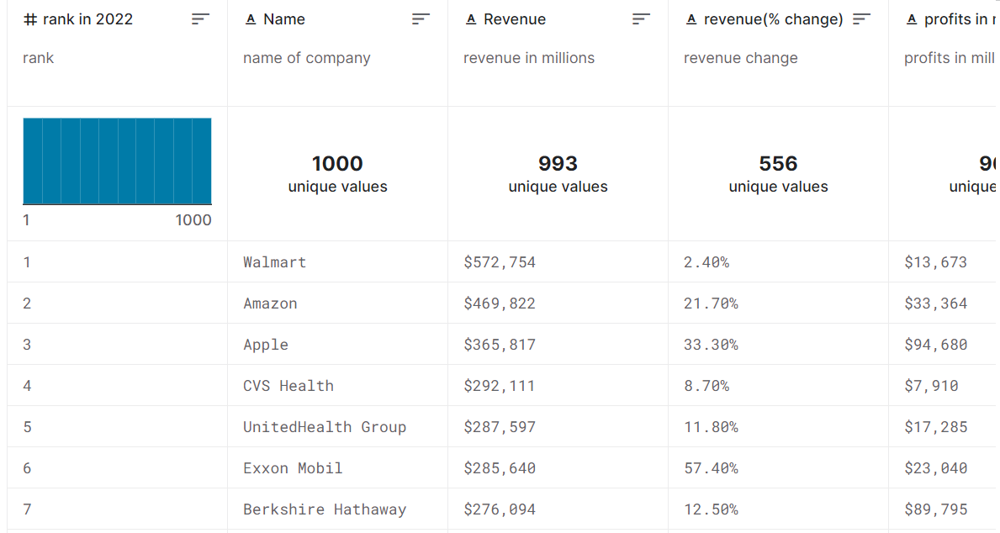
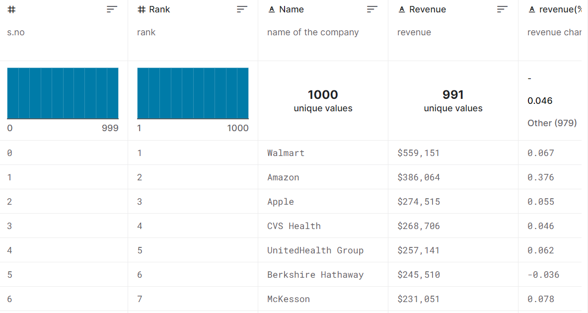
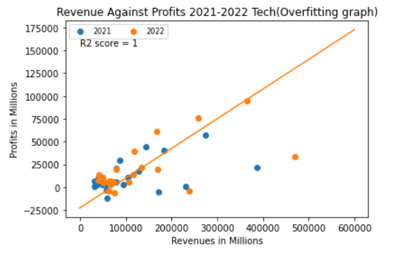

# Predicting 2023 Tech & Non-Tech Industry Profit Margins
## Using 2021-2022 Fortune 100 Company data (revenue & expenses) to predict 2023 industry health

### Project Summary: 
By acquiring the revenue and expenses for both Tech and Non-Tech Fortune 100 companies, logistic regression can be used to predict the health (profit margin) of a sector for 2023. In this file it will highlight the three major steps for implementing this type of machine learning algorithm as well as hightlight the basic Data Science techniques necessary to take for a valid and repeatable solution. This project matters because consulting firms need to adjust the way they approach their sales/pursuit efforts in the tech and non-tech sectors during a volatile market.

<table width = "100%">
    <tr>
        <td>
             
        </td>
        <td>
            
        </td>
        <td>
            
        </td>
         <td>
            
        </td>
    </tr>
</table>
**Companies Revenue, Profit, & Expenses Source:** https://www.kaggle.com/datasets/ramjasmaurya/fortune-1000-companieslatest

### Table Of Contents
1. [Pre-Processing](#pre-processing)
2. [Analysis](#analysis)
3. [Modeling](#modeling)
4. [Working Directory](#working-directory)
5. [References](#references)

### Pre-Processing


### Analysis


### Modeling


### Working Directory
```
.
│   README.md    
│
└───Data(Pre-Processed)
│   │   Fortune 1000 companies in 2021-2021.csv
│   │   Fortune 1000 companies in 2022-2022.csv
│   │   ...
│   └───Processed data 
│       │   Fortune 100 Company Data (2021).csv
│       │   Fortune 100 Company Data (2022).csv
│       │   ...
│   
└───Images
│   │   Capture.png
│   │   file022.txt
│   │   ...
│   
└───Notebooks
│   │   Project Notebook.ipynb
│   │   ...
│  
└───.ipynb_checkpoints
    │   Project Notebook-checkpoint.ipynb
    │   ...
    
```

### References
https://scikit-learn.org/stable/modules/generated/sklearn.linear_model.LogisticRegression.html
https://stephenallwright.com/cross_val_score-sklearn/https://stephenallwright.com/cross_val_score-sklearn/
Dataset:
https://www.kaggle.com/datasets/ramjasmaurya/fortune-1000-companieslatest

